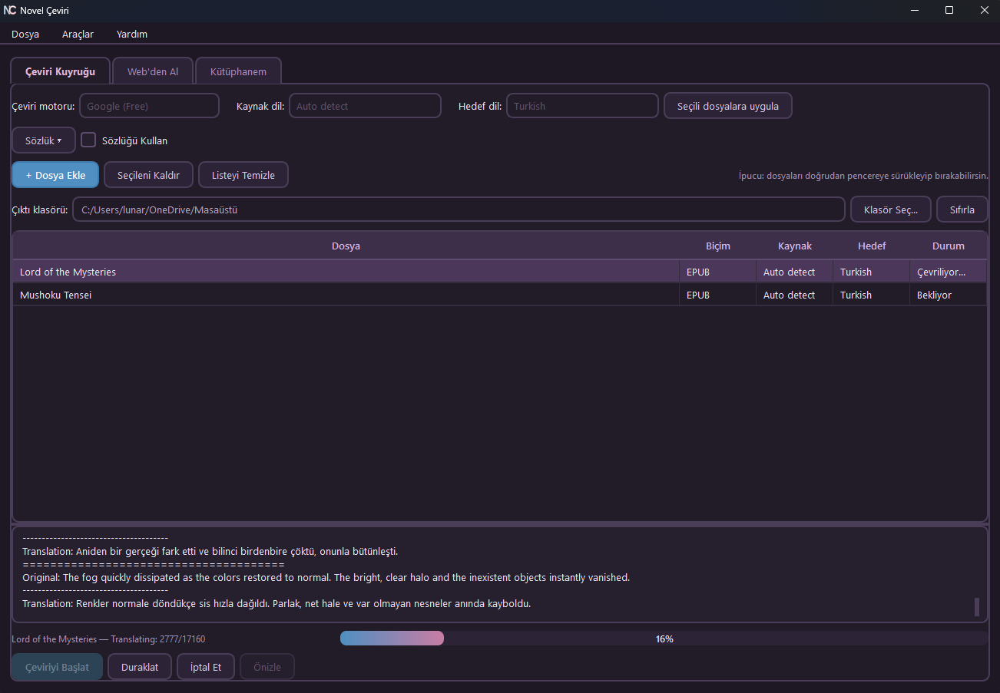
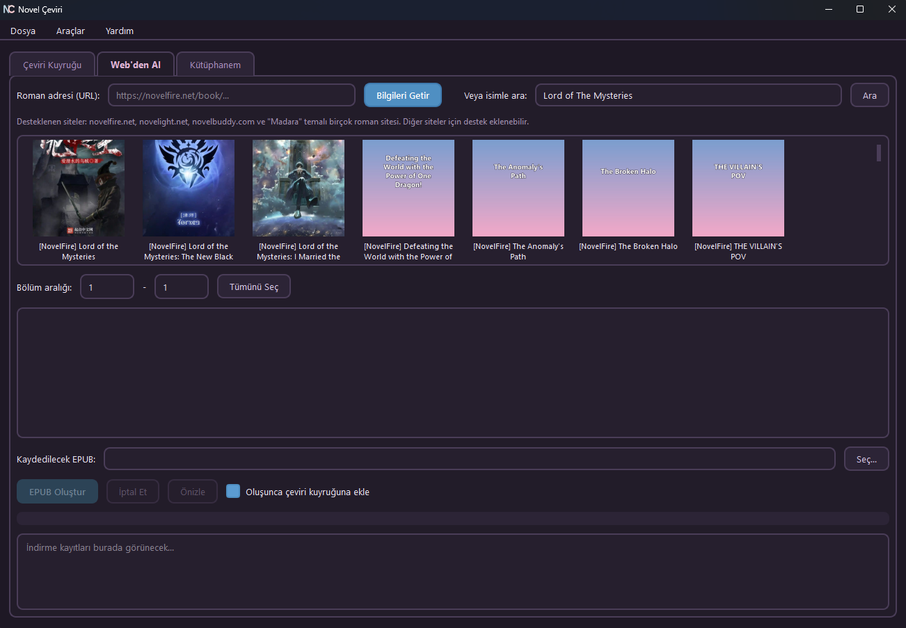
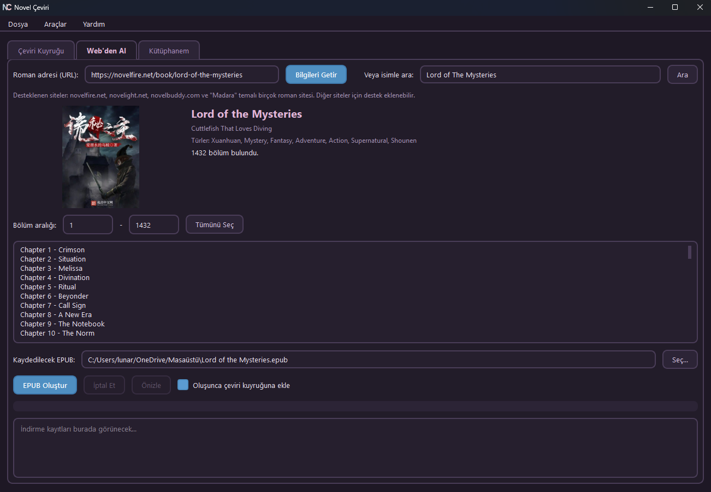
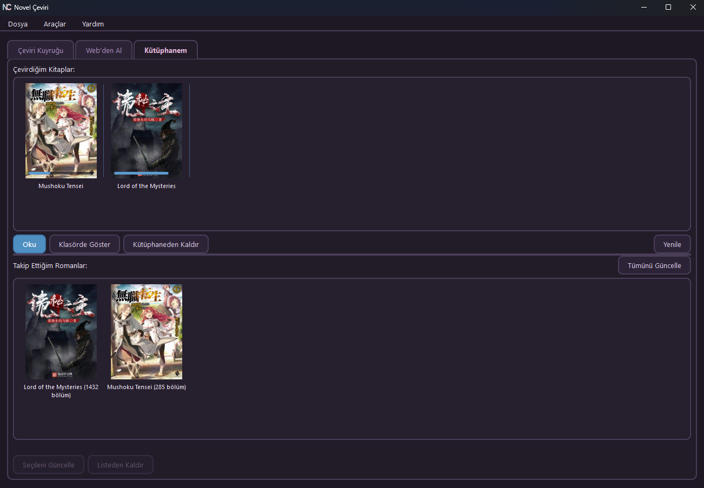

<div align="center">


# Novel Çeviri

**Webnovel ve lightnovel'leri hızlıca Türkçeye (veya istediğin dile) çeviren, bağımsız bir masaüstü programı.**

[](LICENSE)
[](https://www.python.org/)
[](#kurulum)
[](https://pypi.org/project/PyQt6/)

</div>

---

## Ekran Görüntüleri

<div align="center">

<br /><br />

<br /><br />

<br /><br />

</div>

## Özellikler

### Çeviri

- **EPUB, TXT ve SRT** dosyalarını çevirir -- biçim, resim, CSS, altyazı zamanlaması bozulmadan korunur.
- **8 hazır motor** arasından seç: Google (Free), Microsoft Edge (Free), DeepL (Free/Pro), Gemini, OpenAI, Claude (Anthropic), OpenRouter -- ayrıca kendi API'ni JSON ile tanımlayıp listeye ekleyebilirsin (kendi sunucun, OpenAI-uyumlu bir model, vb.).
- **Gerçek hız ve güvenilirlik**: her motor için ayrı eşzamanlı istek sayısı ve istekler arası bekleme süresi (ücretsiz/limitli motorlarda varsayılan olarak temkinli, ücretli motorlarda daha hızlı); hız sınırına çarpınca otomatik yeniden deneme; kısa paragrafları birleştirip istek sayısını azaltma; kalıcı önbellek (aynı paragrafı iki kez çevirmez).
- **Sözlük desteği**: karakter/yer adlarının her bölümde aynı şekilde çevrilmesini (ya da hiç çevrilmemesini) sağlar. Seçili dosyadan sık geçen özel isim/terimleri otomatik çıkarıp sözlüğe önerir.
- **Ücretli motor uyarısı**: ücretli bir motorla çeviriye başlamadan önce toplam karakter sayısını gösterir, yanlışlıkla büyük bir faturayla karşılaşmazsın.
- **İki dilli çıktı**: orijinal metni çevirinin altında/üstünde/yalnızca çeviri şeklinde tutma seçeneği.
- Yoksay/koru/filtre kuralları (CSS seçici veya metin eşleşmesiyle) ile neyin çevrileceğini ince ayarla.

### Web'den roman indirme

- novelfire.net, novelight.net, novelbuddy.com ve "Madara" temalı birçok sitedeki romanları **isimle ara** (kapak resimleriyle, kütüphane görünümünde) veya **adresini yapıştır**, bölüm aralığını seç, doğrudan EPUB'a çevir.
- **Kütüphane takibi**: indirdiğin romanları arka planda periyodik olarak kontrol eder, yeni bölüm çıkınca masaüstü bildirimi gönderir; tek tıkla veya hepsini birden güncelleyebilirsin -- yeni bölümler var olan EPUB'a eklenir, üzerine yazılmaz.
- **Devam ettirilebilir indirme**: bağlantı kesilse veya iptal etsen de, daha önce inen bölümler diskte kalır.

### Kütüphane ve okuma

- **Kütüphanem** sekmesinde çevirdiğin tüm kitapları ve takip ettiğin romanları kapak resimleriyle (kütüphane/galeri görünümünde) görürsün; okuma ilerlemen kapak üzerinde bir çubukla gösterilir.
- **Uygulama içi EPUB okuyucu**: bölüm listesi, yazı tipi seçimi, yazı boyutu ve açık/karanlık/sepya okuma temalarıyla kitabı uygulamadan çıkmadan okuyabilirsin.
- Kitapları doğrudan masaüstüne sürükleyip kopyalayabilir, dosya konumunu Explorer'da açabilirsin.

### Genel

- **Sade ama tatlı arayüz**: açık pastel ve karanlık tema, sistem tepsisi desteği, motor bağlantısını tek tıkla test etme.
- **İlk kurulum sihirbazı**: programı ilk açtığında motor ve hedef dili birkaç tıkla ayarlamana yardımcı olur.
- **Güncelleme kontrolü**: yeni bir sürüm çıktığında haber verir, dilersen o sürümü atlayabilirsin.
- Çöken/hata veren bir şey olursa `%APPDATA%/NovelCeviri/app.log` dosyasında neyin yanlış gittiğini bulabilirsin.

## Kurulum

### Hazır .exe ile (Windows, önerilen)

[Releases](../../releases) sayfasından en son `NovelCeviri.exe` dosyasını indirip çalıştırman yeterli -- Python kurmana gerek yok.

### Kaynak koddan çalıştırma

```bash
git clone https://github.com/aysalry/Novel-Ceviri.git
cd "Novel-Ceviri"
pip install -r requirements.txt
python main.py
```

Windows'ta konsol penceresi açılmadan çalıştırmak için `main.py` yerine `main.pyw` kullanabilirsin (çift tıklayarak veya `pythonw main.pyw` ile).

### Kendi .exe'ni build etmek

```bash
pip install pyinstaller
pyinstaller NovelCeviri.spec
```

Çıkan dosya `dist/NovelCeviri.exe` olur.

## Kullanım

1. **Çeviri Kuyruğu** sekmesinde "+ Dosya Ekle" ile EPUB/TXT/SRT dosyalarını ekle (ya da pencereye sürükle-bırak).
2. Çeviri motorunu ve hedef dili seç, istersen **Sözlük** menüsünden seçili dosyadan terim çıkarıp özel isimlerin çevirisini sabitle, "Çeviriyi Başlat"a bas.
3. Elindeki dosya yoksa **Web'den Al** sekmesinde roman adını ara (kapak resimleriyle gelen sonuçlardan birini seç) veya adresini yapıştır, bölüm aralığını seç, "EPUB Oluştur"a bas -- "Çeviri kuyruğuna ekle" işaretliyse indirilen EPUB otomatik olarak çeviri kuyruğuna eklenir, ister Kütüphanem'e de eklenir.
4. **Kütüphanem** sekmesinden çevirdiğin kitapları uygulama içi okuyucuyla okuyabilir, takip ettiğin romanları tek tıkla güncelleyebilirsin.
5. Motor/API anahtarı ayarlarını, hız ayarlarını ve görünümü **Araçlar > Ayarlar**'dan değiştirebilirsin; "Test Et" ile bir motorun gerçekten çalıştığını kaydetmeden önce doğrulayabilirsin.

## Teşekkürler ve Lisans

Bu proje, [bookfere.com](https://github.com/bookfere) tarafından geliştirilen açık kaynaklı **["Ebook Translator" Calibre eklentisinden](https://github.com/bookfere/Ebook-Translator-Calibre-Plugin)** (GPLv3) uyarlanmış bir çeviri motoru, önbellek ve içerik çıkarma mantığı kullanır; bu nedenle bu proje de **GPLv3** ile lisanslanmıştır (bkz. [LICENSE](LICENSE)).

Roman indirme özelliği, [dteviot](https://github.com/dteviot)'un **["WebToEpub"](https://github.com/dteviot/WebToEpub)** (GPLv3) ve [kodjodevf](https://github.com/kodjodevf)'in **["Mangayomi"](https://github.com/kodjodevf/mangayomi)** (Apache 2.0) projelerinden esinlenerek sıfırdan yazılmıştır.

## Sorumluluk Reddi

Bu araç yalnızca kendi sahip olduğun ya da telif hakkı içermeyen içerikleri çevirmek/indirmek için tasarlanmıştır. Üçüncü taraf sitelerden içerik çekerken o sitelerin kullanım şartlarına uymak kullanıcının sorumluluğudur.
